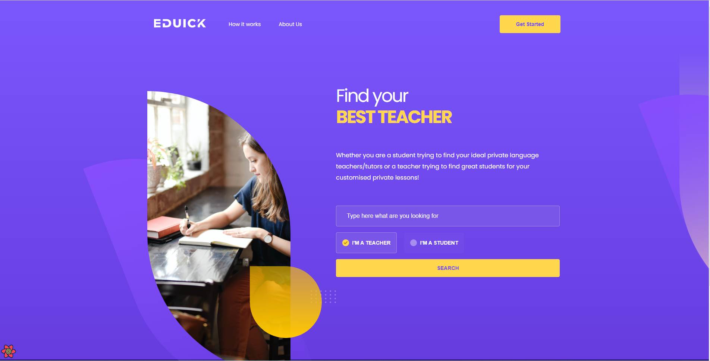
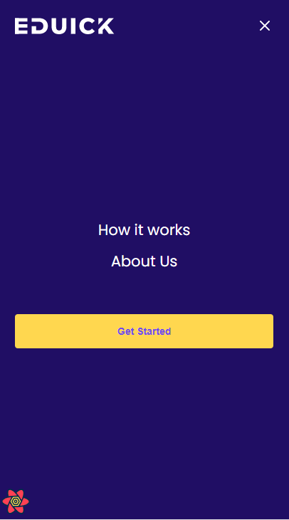
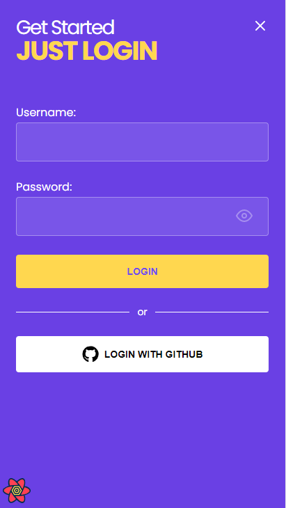
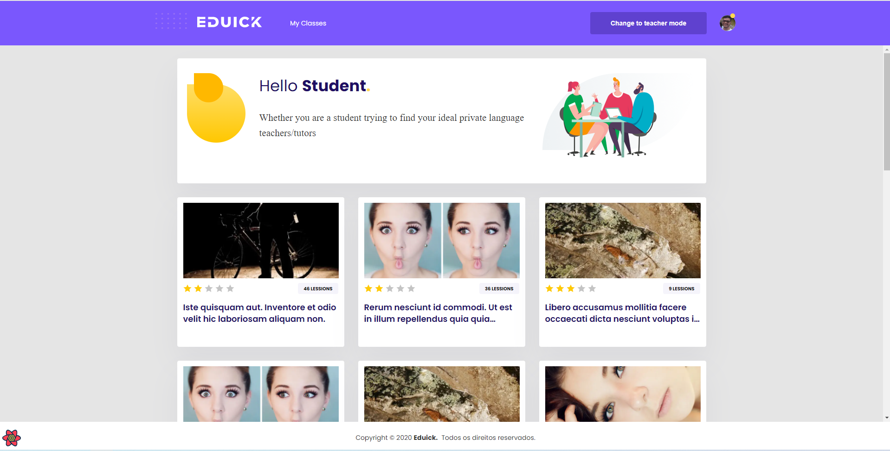
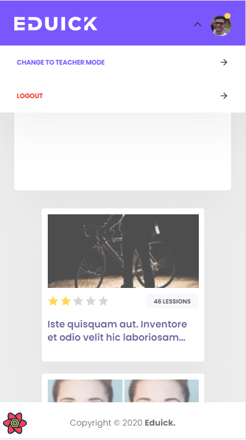
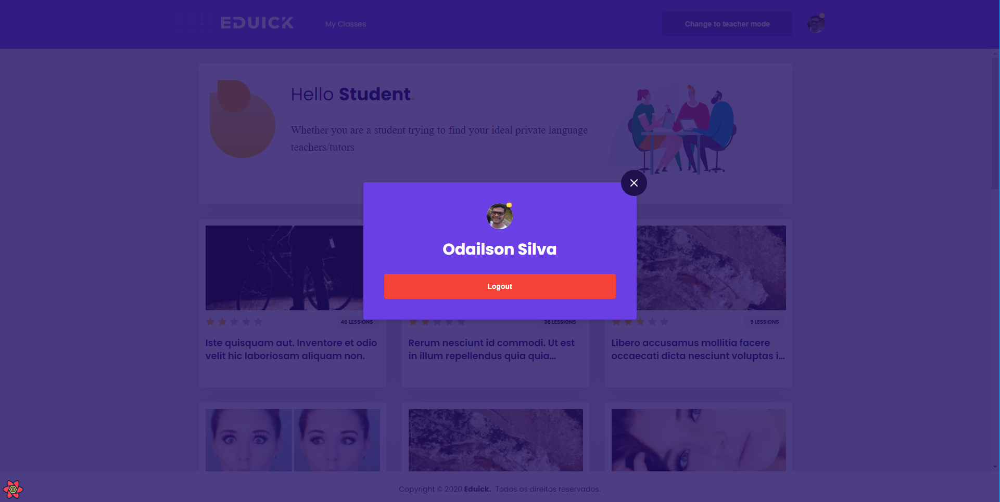

<h1 align="center">
<a href="#" alt="site do ecoleta"> Eduick </a>
</h1>

<h3 align="center">
    Desafio para desenvolvedor front-end para EduSynch
</h3>

Tabela de conteúdos
=================
<!--ts-->
   * [Sobre o projeto](#-sobre-o-projeto)
   * [Funcionalidades](#-Páginas-a-serem-construídas)
   * [Layout](#-layout)
     * [Web](#web)
   * [Como executar o projeto](#-como-executar-o-projeto)
     * [Rodando a aplicação web (Frontend)](#user-content--rodando-a-aplicação-web-frontend)
   * [Tecnologias](#-tecnologias)
     * [WebSite](#user-content-website--react----typescript)
   * [Autor](#-autor)
   * [Licença](#user-content--licença)
<!--te-->


## 💻 Análise sobre o desenvolvimento do projeto

Desenvolvido com NextJs e Typescript. Contém uma fake api, MirageJs. Focado nas melhores práticas de programação, visando a manutenibilidade, teste e documentação.
Usada a arquitetura e padrão de projeto Atomic Designer, para os componentes.


---

## ⚙️ Páginas a serem construídas

- [x] LandingPage;
  - [x] Implementar ação visual de check dos itens: "I'm a teacher" e "I'm a student";
  - [x] Arquivo modal-menu deverá ser resultado do clique no menu hamburguer (responsive mode);
  - [x] Ao clicar em "Get Started" mostrar modal de login;
  - [x] Usabilidade de formulário e autenticação (React Hook Form, Yup e SSR)
  - [x] Login social com GitHub (NextAuth)
- [x] Dashboard (Rota privada);
  - [x] Adicionar requisição para trazer lista de cursos (MirageJs);
  - [x] Implementar scroll infinito ou paginação;
  - [x] Na versão mobile implementar ação de dropdown (onde aparece change to teacher mode);
- [x] Teste Unitários e documentação(Somente em alguns atomos);
- [x] Html Semântico;
- [x] CSS bem estruturado;
- [x] Comentar o código, quando necessário, para explicar a intenção de trechos complexos;
- [x] Escrever um bom README explicando como instalar e executar o projeto;
- [x] Otimização dos assets (Image);
- [x] Utilizar Next.js ou CRA (SSR usado para autenticação);
---

## 🎨 Layout

O layout da aplicação está disponível no Figma: https://www.figma.com/file/vxbTpBRViZn0dY5EnjlVMZ/Eduick

<a href="https://www.figma.com/file/XTbAE7DPmkrAI0b5hmzB64Vd/Appetit-Web?node-id=1%3A3">
  
</a>

### Print das telas desenvolvidas

<p align="center" style="display: flex; align-items: flex-start; justify-content: center;">

  ### LandingPage

  

  #

  ### MenuBurguer

  <div align="center">
    
  </div>

  #

  ### Login/Login Social

  <div align="center">
    
  </div>


  

  #

  ### Dashboard

  

  #


  ### Dropdown

  <div align="center">
    
  </div>

  #

  ### Modal Profile

  

</p>

---

## 🚀 Como executar o projeto
```bash
##ATENÇÃO PARA LOGAR COM EMAIL
EMAIL: user@eduick.com
SENHA: Teste123@

```
#### 🧭 Rodando a aplicação

```bash

# Clone este repositório
$ git clone https://github.com/odailsonsilva/eduick-next.git

# Acesse a pasta do projeto no seu terminal/cmd
$ cd eduick-next

# check se esta na banch master

# Instalando dependências
$ yarn

#  ou

$ npm install

# Execute a aplicação em modo de desenvolvimento
$ yarn dev

#   ou

$ npm run dev

## Comandos para build
$ yarn build

# DEPOIS
$ yarn start

## OBS: CASO QUEIRA TESTAR A PARTE DE LOGIN SOCIAL, PRECISARÁ FAZER A CONFIGURAÇÃO ABAIXO
## EXISTE UM ARQUIVO NA RAIZ DO PROJETO CHAMADO ".ENV.LOCAL.EXAMPLE", USE-O COMO BASE PARA CRIAR SEU ARQUIVO
## CRIAR UM ARQUIVO COM O NOME .ENV.LOCAL NA RAIZ DO PROJETO
## USE AS COPIE AS CREDENCIAS DO ARQUIVO DE EXEMPLO PARA DENTRO DO ARQUIVO QUE VOCÊ CRIOU, AGORA E SO SALVAR

## CASO OCORRA ALGUM ERRO, SUBSTITUA AS CREDENCIAS (CLIENT_ID E SECRET) PELAS SUAS.

# A aplicação será aberta na porta:3000 - acesse http://localhost:3000

## OUTROS COMANDOS

# STORYBOOK (EXECUTA A DOCUMENTAÇÃO DOS COMPONENTE ISOLADO, AQUI SÓ ESTÃ0 ALGUNS COMPONENTE PARA EXEMPLIFICAR A CONTRUÇÃO DOS MESMOS)
$ yarn storybook

# Testes  (AQUI SOMENTE ALGUNS COMPONENTE FORAM TESTADOS, OS QUE ESTÃO DENTRO DE ATOMOS)
$ yarn test

# Automatização para criação de componentes, (CRIA UMA ESTRUTURA COM - index.tsx, styles.ts, stories.tsx e tests.ts)
$ yarn generate [nome]

```

---

## 🛠 Tecnologias

Principais dependências usadas no projeto:

#### **Website**  ([Next](https://nextjs.org/)  +  [Typescript](https://www.typescriptlang.org/))

-   **[StoryBook](https://storybook.js.org/)** - Ferramenta de código aberto para a construção de componentes de interface do usuário e páginas de forma isolada.
-   **[React Icons](https://react-icons.github.io/react-icons/)** - Biblioteca de icones.
-   **[Styled Components](https://github.com/styled-components/styled-components)** - CSS-in-js
-   **[Jest](https://jestjs.io/pt-BR/)** - Framework para testes em Javascript.
-   **[Testing Library](https://testing-library.com/docs/react-testing-library/intro/)** - Lib para testar componentes.
-   **[Prettier](https://prettier.io/)** -  Formatador de código opinativo.
-   **[Eslint](https://eslint.org/)** - Ferramenta para identificar e relatar os padrões encontrados no código ECMAScript / JavaScript, com o objetivo de tornar o código mais consistente e evitar bugs.
-   **[Plop](https://plopjs.com/)** - Automatização de criação de componentes.
-   **[Axios](https://github.com/axios/axios)** -  Cliente HTTP baseado em promessa para node.jse o navegador.
-   **[React query](https://react-query.tanstack.com/)** - Ferramenta para data fetching.
-   **[Mirage](https://miragejs.com/)** - Biblioteca de simulação de API.


> Veja o arquivo  [package.json](https://github.com/odailsonsilva/eduick-next/blob/dev/package.json)


#### [](https://github.com/tgmarinho/Ecoleta#utilit%C3%A1rios)**Utilitários**

-   Protótipo:  **[Figma](https://www.figma.com/file/vxbTpBRViZn0dY5EnjlVMZ/Eduick)**
-   Editor:  **[Visual Studio Code](https://code.visualstudio.com/)**


## 🦸 Desenvolvedor

<a href="">
 
 <br />
 <sub><b>Odailson Silva</b></sub>
 <br />

[](https://www.instagram.com/odailsonsilva_/)
[](https://www.linkedin.com/in/odailson-silva-2564051a0/)
[](mailto:odafreelancerti@gmail.com)

---

## 📝 Licença

Este projeto esta sobe a licença [MIT](./LICENSE).

Feito com ❤️ por Odailson 👋🏽 [Entre em contato!](https://www.linkedin.com/in/odailson-silva-2564051a0/)
